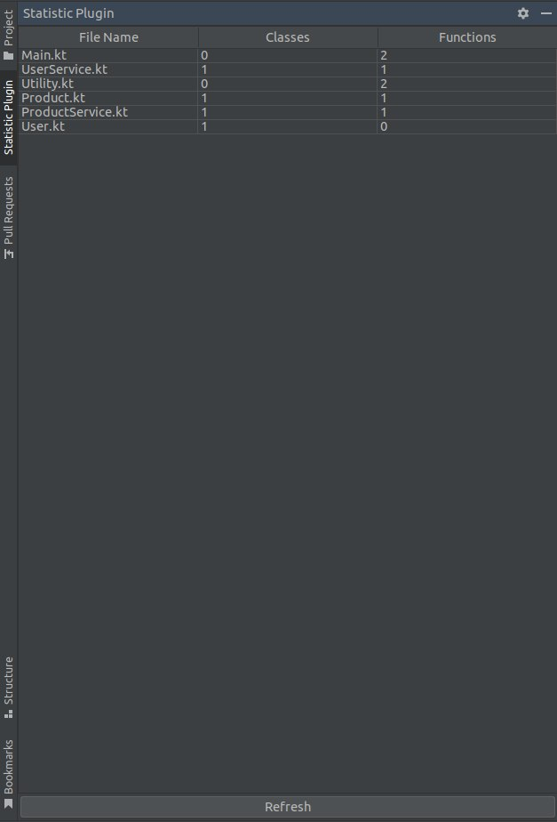

# StatisticPlugin
<!-- Plugin description -->
This IntelliJ IDEA plugin provides an additional side panel that displays the number of classes and functions for each Kotlin file in the currently open project.
<!-- Plugin description end -->
## Features 
- Counts the number of Kotlin classes, including inner classes and objects.
- Counts the number of Kotlin functions, including top-level functions and member functions.
- Provides a "refresh" button to update the count.
##

## Structure 
- Main logic is located in ```MyProjectService.kt```
- UI is located in ```MyToolWindowFactory.kt```
- Tests are located in ```test``` directory
## Installation

- Using the IDE built-in plugin system:
  
  <kbd>Settings/Preferences</kbd> > <kbd>Plugins</kbd> > <kbd>Marketplace</kbd> > <kbd>Search for "StatisticPlugin"</kbd> >
  <kbd>Install</kbd>
  
- Manually:

  Download the [latest release](https://github.com/nekitivlev/StatisticPlugin/releases/latest) and install it manually using
  <kbd>Settings/Preferences</kbd> > <kbd>Plugins</kbd> > <kbd>⚙️</kbd> > <kbd>Install plugin from disk...</kbd>


---
Plugin based on the [IntelliJ Platform Plugin Template][template].

[template]: https://github.com/JetBrains/intellij-platform-plugin-template
[docs:plugin-description]: https://plugins.jetbrains.com/docs/intellij/plugin-user-experience.html#plugin-description-and-presentation
